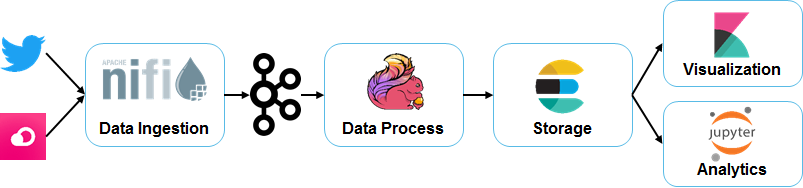

# Docker-based Streaming Architecture

End-to-end streaming architecture (from ingestion to analytics), based on Docker containers.



## Setup

### Pre-requisites

* Download & install Docker: https://docs.docker.com/install/

### Launch the architecture

* Go to the main Docker Compose folder:

```
cd src/main
```

* Run the Docker compose:

```
docker-compose up -d
```

## Component list

The list of components and it Docker name is the following:

| Service | Description | Service/Hostname | Port | URL (when applies) |
| --- | --- | --- | --- | --- |
| **Apache NiFi** | Data ingestion tool | nifi | 8090 | http://192.168.99.100:8090/nifi/ |
| **Apache Kafka (broker)** | Distributed message broker | kakfa | 9092 | .. |
| **Apache Kafka (zookeeper)** | Configuration Manager | zookeeper | 2181 | .. |
| **Kafka Manager** | Tool for managing Kafka (clusters, topics,  etc.) | kafka-manager | 9000 | http://192.168.99.100:9000 |
| **Elasticsearch** | Document storage and indexing/search tool | elasticsearch | 9200 | http://192.168.99.100:9200 |
| **Kibana** | Data visualization tool for Elastic | kibana | 5601 | http://192.168.99.100:5601 |
| **Jupyter** | Data analytics notebooks | jupyter | 8888 | http://192.168.99.100:8888 |
| **cAdvisor** | Docker monitoring tool | monitor | 8080 | http://192.168.99.100:8080 |

## Reference

* Apache NiFi Docker Image: https://hub.docker.com/r/apache/nifi/
* Apache Kafka Docker Image:: https://hub.docker.com/r/bitnami/kafka/
* Kafka Manage Docker Image: https://hub.docker.com/r/sheepkiller/kafka-manager
* Elasticsearch Docker Image: https://hub.docker.com/_/elasticsearch
* Kibana Docker Image: https://hub.docker.com/_/kibana
* Jupyter Docker Image: https://hub.docker.com/r/jupyter/datascience-notebook
* **cAdvisor**
  * Docker Image: https://hub.docker.com/r/google/cadvisor/
  * Documentation: https://github.com/google/cadvisor

## Maintenance

### Starting and stopping things

In order to stop/start single service, use the following commands:

```
docker-compose start <Service>
```

Where the **<Service>** is listed in the table above ("Component list" section).

### Reading the logs

List the running containers first:

```
docker ps
```

Then use the following command to

```
docker logs <CONTAINER ID or NAME>
```

### Destroy everything

Use the following command to stop all services and remove the containers:

```
docker-compose down
```

## Troubleshooting

### Adding more memory for the containers

* Using the Docker configuration (when native)
* Manually, using command line
```
docker-machine stop
VBoxManage modifyvm default --cpus 2
VBoxManage modifyvm default --memory 4096
docker-machine start
```

More info: https://stackoverflow.com/questions/32834082/how-to-increase-docker-machine-memory-mac
